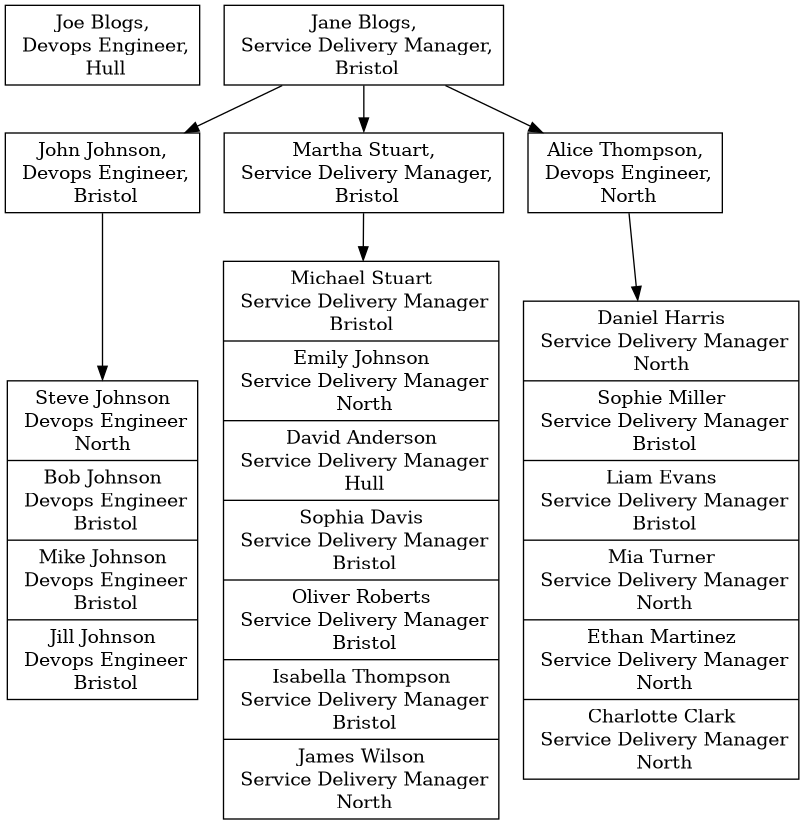

# TLDR

This app takes the contents from the `data/lead.json` `data/line.json` and `data/team.json` and creates a db in mongodb with three collections. Replace the Mock data with your own team strucutre.

You will need to supply the connection details as an environmental variable, the `dotenv` crate is included so you can add a file called `.env` to the root of this repo and put a variable in there called `MONGODB_URI`.

when you execute `cargo run` It then generates a `diagram.dot` file. You then need to run graphviz to build a graph from this, you can find download instructions [here](https://graphviz.org/download/)

Once installed you can run this command to generate the diagram:

`dot -Tpng diagram.dot -o diagram.png`

It then reads that content and generates a diagram which looks like this:

# Team Structure Visualization App

This application is designed to visualize the structure of a team using Graphviz. It reads data from a MongoDB database and generates a Graphviz diagram that shows the hierarchy and relationships within the team.

## How it works

The application is written in Rust and uses the `mongodb` and `tokio` libraries to connect to a MongoDB database and read data asynchronously. The data represents team members, line managers, and practice leads, and includes their names, roles, and the person they report to.

The application generates a Graphviz diagram from this data. Each person is represented as a node in the diagram, and the reporting relationships are represented as edges between the nodes. The diagram uses different shapes and labels to distinguish between practice leads, line managers, and team members.

The application is structured into two main parts:

1. **Data Reading**: This part of the application connects to the MongoDB database and reads the data. It uses the `dotenv` library to manage environment variables for the database connection. The data is read into `Person` structs, which are then collected into vectors for practice leads, line managers, and team members.

> **Note** I have included three json files which contain mock data for some practice leads, line managers and team members, when the app is run it will look for the database and collections in mongodb and if they are not there create them. You can replace the mock data with real data and it will import it into mongodb for you automatically.

2. **Diagram Drawing**: This part of the application generates the Graphviz diagram. It iterates over the vectors of practice leads, line managers, and team members, and generates Graphviz code for each person. It also generates code for the edges between the nodes based on the reporting relationships.

## How to use it

To use the application, you need to have a MongoDB database with the team data. The database should have collections for practice leads, line managers, and team members. Each document in the collections should have fields for the name, role, and manager of the person.

You also need to have Rust and Cargo installed, and you need to add the connection string for your MongoDB database to a `.env` file in the root of the project.

To run the application, use the command `cargo run` in the terminal. The application will connect to the database, read the data, and generate the Graphviz diagram. The diagram is output as a string of Graphviz code, which you can save to a file and render using a Graphviz tool.

## Future improvements

In the future, the application could be extended to include more information in the diagram, such as the skills and certificates of each person. It could also be modified to generate different types of diagrams, such as pie charts or bar graphs, to visualize different aspects of the team structure.
